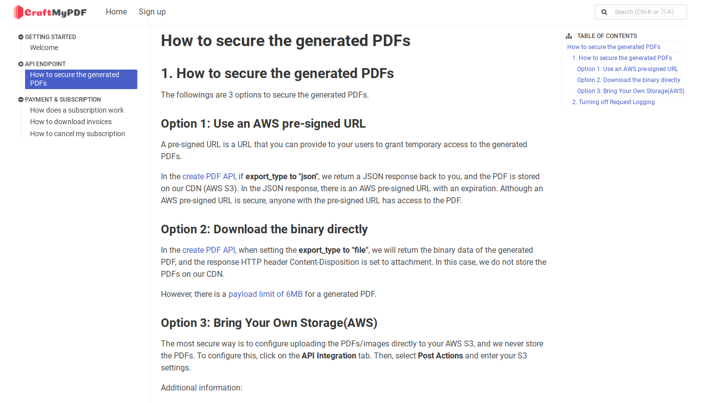

# Notion2Pages
Introducing Notion2Pages, the ultimate tool for transforming your Notion pages into professional technical documentation. 

Inspired by the [developer guide of Notion](https://developers.notion.com/docs) itself, this tool empowers you to effortlessly convert your Notion pages into beautifully formatted documents, ready to be shared with your team or audience.

[Sample Technical Documentation - CraftMyPDF](https://support.craftmypdf.com)



## How to build 
- Step 1: Duplicate the Notion page: [here](https://pepper-leopard-8d1.notion.site/Knowledge-Base-Sample-65a826c2c17a4bb7aafe673719571cd8?pvs=4)
 
- Step 2: Clone the GitHub repo
  ```
  https://github.com/imbktan/notion2pages
  ```
- Step 3: Create a file named `settings-prod.js` by duplicating `settings.js`.
- Step 4: Update the `apiKey` and `pageID`(to the Notion page that you cloned) in `settings-prod.js`
- Step 5: Run build.sh
- Step 6: Copy all the content in the build folder to your web server, Cloudflare Pages, or AWS S3.
  

## Deployment Options
- Cloudflare pages
- AWS S3